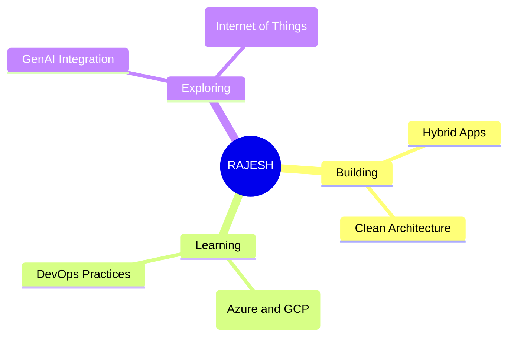

## 

  

  
  <!--  -->
  

  

    With 18+ years of experience, I'm a Senior Software Engineer at
    Capgemini, specializing in frontend UI development and mockup
    design. I have extensive experience with web technologies including
    HTML5, SASS, React, Redux, Node, Express, Webpack, TypeScript,
    Bootstrap, and Tailwind, and a strong focus on cross-browser
    compatibility and performance tuning.

    
My design and animation skills cover Photoshop, Adobe XD,
    Illustrator, and Adobe Animate. I'm also familiar with platforms like
    Salesforce Commerce Cloud, Adobe Experience Manager,
    Magento, and WordPress.

    
I excel in the end-to-end application development lifecycle, from
    requirements analysis and system design to coding, testing,
    debugging, documentation, and implementation. I'm a team player
    with strong interpersonal and communication skills, adept at
    coordinating with project teams and business users. I can resolve
    complex issues independently, and I'm skilled in training and
    mentoring subordinates.

## Tech Stack

### Languages
 
 
 
 

### Frontend Development
 
 
 
 
 
 
 
 

### Backend Development
 
 

### Database Technologies
 
 

### Development Tools & Others
 
 
 

### Cloud Technologies
 

## 🎯 CURRENT FOCUS

  <h2>Github Trophies</h2>
  

## 🤝 Let's Connect!

  

    <strong>I'm always interested in collaborating on exciting projects and learning from other developers.</strong> 
    Feel free to reach out if you want to discuss technology, share ideas, or just chat!
  

  
  

    

      🤝 <strong>Looking to collaborate</strong> on open-source projects
    

    

      💬 <strong>Ask me about</strong> web development, Python, or JavaScript
    

    

      ⚡ <strong>Fun fact:</strong> I love solving coding challenges!
    

  

---

  

**💫 Built with ❤️ by <a href="https://github.com/raajeshsharma" style="text-decoration: none; font-weight: bold;">Rajesh Sharma</a>**  
*Last updated: August 2025*

