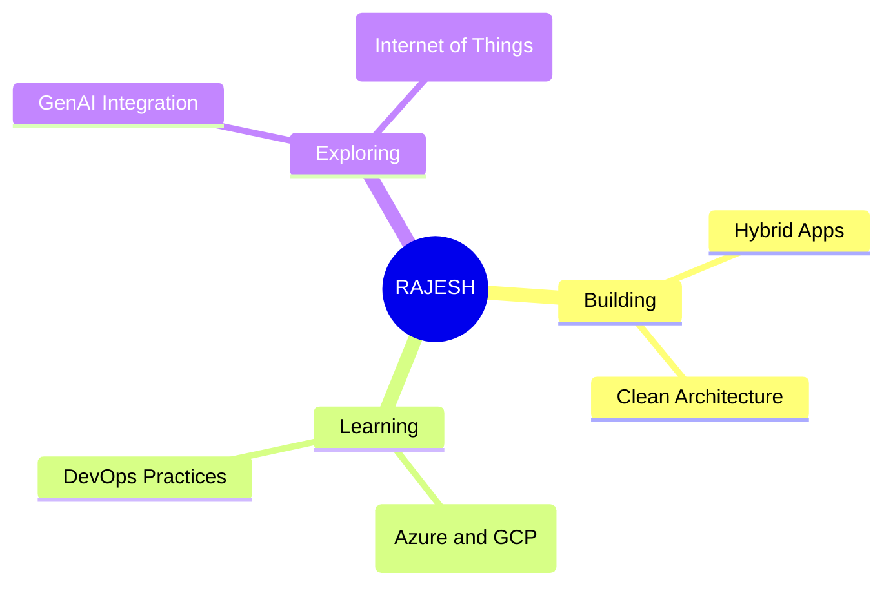

----

            

## About Me

### With 18+ years of experience, I'm a Senior Software Engineer at Capgemini, specializing in frontend UI development and mockup design. I have extensive experience with web technologies including HTML5, SASS, React, Redux, Node, Express, Webpack, TypeScript, Bootstrap, and Tailwind, and a strong focus on cross-browser compatibility and performance tuning.

#### My design and animation skills cover Photoshop, Adobe XD, Illustrator, and Adobe Animate. I'm also familiar with platforms like Salesforce Commerce Cloud, Adobe Experience Manager, Magento, and WordPress.

#### I excel in the end-to-end application development lifecycle, from requirements analysis and system design to coding, testing, debugging, documentation, and implementation. I'm a team player with strong interpersonal and communication skills, adept at coordinating with project teams and business users. I can resolve complex issues independently, and I'm skilled in training and mentoring subordinates.

## Tech Stack

### Languages
 
 
 

### Frontend Development
 
 
 
 
 
 
 
 

### Backend Development
 
 
 

### Database Technologies
 
 

### Development Tools & Others
 
 
 

### Cloud Technologies
 

## 🎯 Current Focus

 -->

## 🏆 GitHub Trophies

  

## 🤝 Let's Connect!

**I'm always interested in collaborating on exciting projects and learning from other developers.**  
Feel free to reach out if you want to discuss technology, share ideas, or just chat!

---

**💫 Built with ❤️ by [Rajesh Sharma](https://github.com/raajeshsharma)**  
*Last updated: August 2025*

